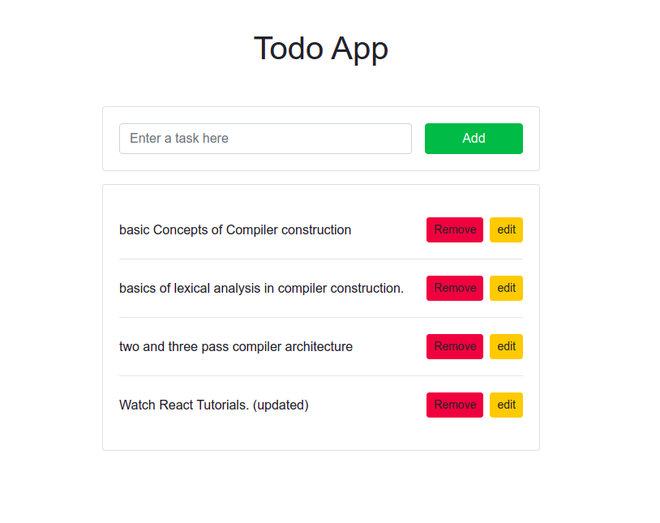

# Django-Todolist
[![License][license-image]][license-url]

Django-Todolist is a todolist web application with the most basic features of most web apps, i.e. CURD functionality, API and (somewhat) interactive UI and javascript verison of the appicaiton that consumes the API.

### Technologies
- Django
- JavaScript
- HTML
- CSS
- Django Rest Framework etc

## Explore
Try it out by installing the requirements. (Works only with python 3++)

    pip install -r requirements.txt

### Migrate:

    python manage.py migrate

And then start the server (default: http://localhost:8000)

    python manage.py runserver

Now you can browse the [API](http://localhost:8000/api/)
or start on the [landing page](http://localhost:8000/)

[license-url]: https://github.com/MuhammadAmir5670/todo-app/blob/master/LICENSE
[license-image]: https://img.shields.io/github/license/MuhammadAmir5670/todo-app?style=flat-square
